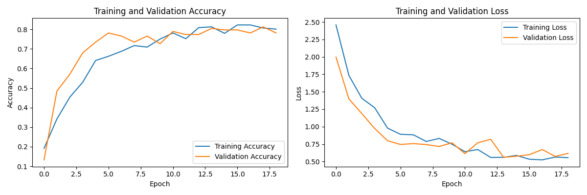
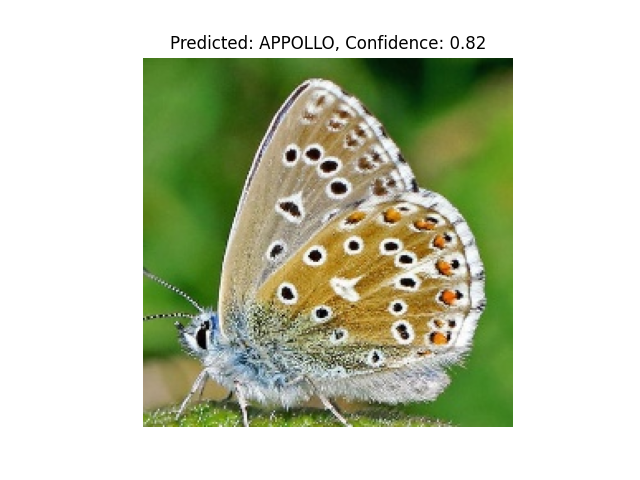
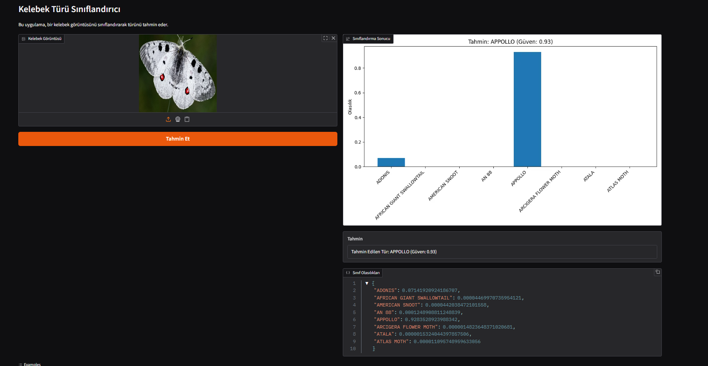

Kelebek Türü Sınıflandırıcı (Butterfly Species Classifier)
Bu proje, bir görüntüde bulunan kelebek türünü otomatik olarak tanıyan ve sınıflandıran yapay zeka destekli bir görüntü sınıflandırma uygulamasıdır. Konvolüsyonel Sinir Ağları (CNN) kullanılarak eğitilmiş model, 8 farklı kelebek türünü yüksek doğrulukla tanıyabilmektedir.
📋 Proje Özeti
Bu uygulama, kullanıcıların yükledikleri kelebek fotoğraflarını analiz ederek türünü belirleyen bir yapay zeka modelini ve kullanıcı dostu bir web arayüzünü içermektedir. Proje, PEAKUP-Bulut Bilişim ve Yapay Zeka Teknolojileri dersi kapsamında geliştirilmiştir.

🦋 Tanıyabildiği Kelebek Türleri
Model aşağıdaki 8 farklı kelebek türünü tanıyabilmektedir:
ADONIS
AFRICAN GIANT SWALLOWTAIL
AMERICAN SNOOT
AN 88
APPOLLO
ARCIGERA FLOWER MOTH
ATALA
ATLAS MOTH

🛠️ Teknolojiler ve Kütüphaneler

Python 3.9+
TensorFlow/Keras: Model eğitimi ve derin öğrenme işlemleri için
Gradio: Kullanıcı arayüzü için
NumPy: Veri işleme için
Matplotlib & Seaborn: Veri görselleştirme için
scikit-learn: Model değerlendirme metrikleri için

📊 Model Performansı
Modelimiz yaklaşık %80 test doğruluğuna sahiptir. Her sınıf için 80 eğitim görüntüsü kullanılarak eğitilmiştir.
Confusion Matrix (Karışıklık Matrisi)

Confusion matrisinden görüldüğü üzere:

ADONIS, AFRICAN GIANT SWALLOWTAIL, AN 88, ATALA ve ATLAS MOTH türleri %100 doğrulukla tanınmaktadır.
APPOLLO türü %80 doğrulukla tanınmaktadır, bazen ADONIS olarak karıştırılabilmektedir.
AMERICAN SNOOT ve ARCIGERA FLOWER MOTH türleri %60-75 arası doğrulukla tanınmaktadır.

Eğitim ve Doğrulama Grafikleri

Eğitim grafikleri, modelin yaklaşık 18 epoch'ta yakınsadığını ve %80 civarında doğruluğa ulaştığını göstermektedir. Görüldüğü üzere validation ve training eğrileri birbirine yakın seyretmektedir, bu da modelin aşırı öğrenme (overfitting) problemi yaşamadığını göstermektedir.
📱 Kullanıcı Arayüzü
Uygulama, Gradio kütüphanesi kullanılarak oluşturulmuş basit ve kullanıcı dostu bir web arayüzüne sahiptir:

Kullanım:

"Kelebek Görüntüsü" bölümüne bir kelebek fotoğrafı yükleyin.
"Tahmin Et" butonuna tıklayın.
Uygulama, yüklenen görüntüyü işleyerek kelebeğin türünü tahmin edecek ve sonuçları gösterecektir.
Tahmin sonuçları, bir grafik olarak ve metin şeklinde görüntülenecektir.

🧠 Model Mimarisi
Model: Sequential
_________________________________________________________________
Layer (type)                 Output Shape              Param #   
=================================================================
conv2d (Conv2D)              (None, 222, 222, 32)      896       
_________________________________________________________________
max_pooling2d (MaxPooling2D) (None, 111, 111, 32)      0         
_________________________________________________________________
conv2d_1 (Conv2D)            (None, 109, 109, 64)      18496     
_________________________________________________________________
max_pooling2d_1 (MaxPooling2 (None, 54, 54, 64)        0         
_________________________________________________________________
conv2d_2 (Conv2D)            (None, 52, 52, 128)       73856     
_________________________________________________________________
max_pooling2d_2 (MaxPooling2 (None, 26, 26, 128)       0         
_________________________________________________________________
flatten (Flatten)            (None, 86528)             0         
_________________________________________________________________
dense (Dense)                (None, 256)               22151424  
_________________________________________________________________
dropout (Dropout)            (None, 256)               0         
_________________________________________________________________
dense_1 (Dense)              (None, 8)                 2056      
=================================================================
Total params: 22,246,728
Trainable params: 22,246,728

🔍Proje Yapısı
butterfly-classifier/
│
├── app.py                           # Gradio web arayüzü
├── train.py                         # Model eğitim scripti
├── model.h5                         # Eğitilmiş model
│
├── train/                           # Eğitim verileri (her sınıf için 80 görüntü)
│   ├── ADONIS/
│   ├── AFRICAN GIANT SWALLOWTAIL/
│   └── ...
│
├── test/                            # Test verileri
│   ├── ADONIS/
│   ├── AFRICAN GIANT SWALLOWTAIL/
│   └── ...
│
├── Confusion_Matrix.png/            # Ekran görüntüleri
├── Predicet.png/                    # Ekran görüntüleri
├── TrainingAndValidation.png/       # Ekran görüntüleri
└── README.md                        # README

📝 Özellikler
-8 farklı kelebek türünü yüksek doğrulukla sınıflandırma
-Kullanıcı dostu web arayüzü
-Gerçek zamanlı görüntü işleme ve tahmin
-Sınıflandırma sonuçlarının görsel olarak sunumu
-Her sınıf için güven skorlarının gösterimi